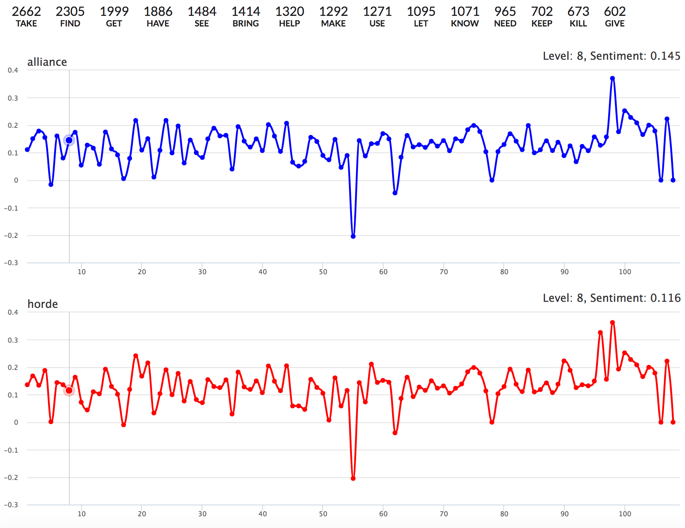

# World of Warcraft Quest Sentiment Analysis

## General Info

The project analyzed sentimental value of quests from [World of Warcraft](https://worldofwarcraft.com/en-us/)

Quests were Fetched from [http://www.wowdb.com](http://www.wowdb.com)



## Installation instructions

If you need to execute Sentiment analysis you will need to install some packages contained in `requirements.txt`

```bash
pip install -r requirements.txt
```

### Run quest parser

```bash
scrapy runspider ./project/spiders/wowdb/wowdb.py
```

### Make analysis

```bash
python ./project/wow-quests.py
```

### HTML Result

To view the results you need to start local HTTP server

```bash
cd ./project/data && python2.7 -m SimpleHTTPServer
```

Open the [http://127.0.0.1:8000/wow.html](http://127.0.0.1:8000/wow.html)

## Result Description

The directory `project/data` will contain:

  * `wow-quests` - a list of dumped wow Quests
  * `wow-quest-series.txt` - data for a 2d graph on `wow.html` page
  * `wow-quest-stat.txt` - per quest sentiment analysis
  * `wow-quest-top-10-verbs.txt` - full list of used verbs and it's count
